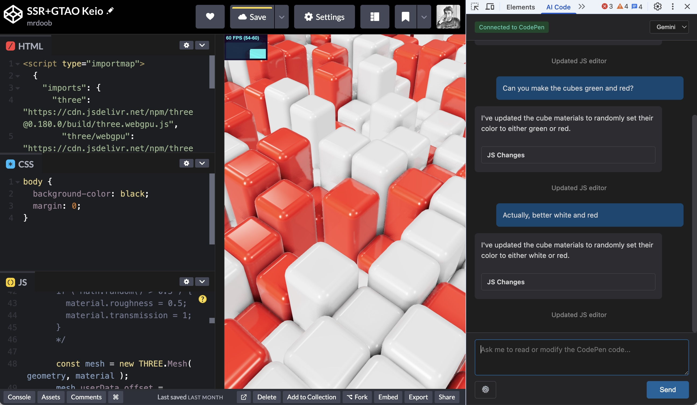

# Chrome Code

Extension Chrome (Manifest V3) qui ajoute un panneau DevTools pour assister l’édition de pens CodePen (HTML/CSS/JS) avec des modèles IA.



## État actuel du projet

Le projet est opérationnel avec :

- un panneau DevTools « Chrome Code » ;
- lecture/écriture du code CodePen via un pont `background -> content -> inject` ;
- application de patches incrémentaux basés sur des blocs `[UPDATE_*]` et paires `<<<SEARCH>>>` / `<<<REPLACE>>>` ;
- support de plusieurs fournisseurs cloud (OpenAI, Anthropic, Gemini, Mistral, DeepSeek, Groq, Perplexity, Together, OpenRouter, xAI) ;
- un mode local basé sur l’API expérimentale Chrome `LanguageModel`.

> Note: les entrées UI `local-ollama`, `local-lmstudio` et `local-vllm` pointent actuellement toutes vers le même backend local `LanguageModel` (pas vers des serveurs Ollama/LM Studio/vLLM externes).

## Fonctionnement

1. Le panel récupère le code courant (`GET_CODE`) depuis l’onglet inspecté.
2. Le prompt système est construit avec l’état courant du code + options utilisateur (mode, scopes, refactor-only, erreurs console récentes).
3. Un appel IA est lancé (`CALL_MODEL` pour cloud, `CALL_LOCAL` pour local).
4. La réponse est parsée :
   - blocs `[UPDATE_HTML]`, `[UPDATE_CSS]`, `[UPDATE_JS]` ;
   - extraction des sections `SEARCH/REPLACE`.
5. Les remplacements valides sont appliqués localement, puis poussés vers CodePen (`UPDATE_CODE`) avec surlignage temporaire des lignes modifiées.

## Architecture

```text
DevTools panel (devtools.js -> panel.html/panel.js)
  ↕ runtime Port
Background service worker (background.js)
  ↕ chrome.tabs.sendMessage
Content script isolé (content.js)
  ↕ window.postMessage
Script main world (inject.js)
  ↕
CodePen editors (CodeMirror 5 et CodeMirror 6)
```

Fichiers principaux :

- `devtools.js` : crée le panneau DevTools.
- `panel.html` / `panel.css` / `panel.js` : UI, réglages, conversation, orchestration patchs.
- `background.js` : routage, appels fournisseurs IA, gestion du mode local.
- `content.js` : pont extension ↔ page.
- `inject.js` : accès direct aux éditeurs CodePen dans le main world.
- `js/updateParser.js` : parsing robuste des blocs `UPDATE_*` et `SEARCH/REPLACE`.
- `js/agents/Agent.js`, `js/agents/LocalAgent.js` : abstraction client d’appel modèle.

## Modèles / fournisseurs supportés

Le mapping modèle → endpoint est centralisé dans `background.js` (`MODEL_ENDPOINTS`).

Exemples de modèles exposés dans l’UI :

- **Local**: `local-ollama`, `local-lmstudio`, `local-vllm` (backend `LanguageModel`).
- **OpenAI**: `gpt-4o`, `gpt-4.1`, `gpt-deep-research`.
- **Anthropic**: `claude-sonnet`, `claude-opus`.
- **Google**: `gemini-free`, `gemini-pro`.
- **OpenAI-compatible**: DeepSeek, Mistral, Perplexity, Groq, Together, OpenRouter, xAI.

## Permissions et sécurité

`manifest.json` déclare :

- permissions: `activeTab`, `storage` ;
- host permissions: CodePen (+ sous-domaines), `cdpn.io`, et endpoints API des fournisseurs listés ci-dessus.

Points de sécurité côté rendu/bridge :

- rendu assistant Markdown via `marked` + sanitation `DOMPurify` ;
- filtrage strict des messages `window.postMessage` par `source` ;
- clés API stockées en local (`chrome.storage.local`).

## Gestion des erreurs implémentée

- reconnexion automatique du port runtime côté panel ;
- timeout des appels agents (45s cloud, 60s local) ;
- timeout du bridge content/inject ;
- vérification de disponibilité du modèle local (`LanguageModel.availability()`) ;
- rejet des patches ambigus ou introuvables.

## Développement

### Charger l’extension localement

1. Ouvrir `chrome://extensions`
2. Activer **Developer mode**
3. Cliquer **Load unpacked**
4. Sélectionner ce dossier

### Vérification rapide

Le parser est testé avec Node :

```bash
node tests/updateParser.test.js
```

## Limitations connues

- Fort couplage à la structure DOM CodePen.
- Pas de gestion multi-fichiers/projets hors contexte d’un pen actif.
- L’édition incrémentale dépend de la qualité des blocs `SEARCH/REPLACE` fournis par le modèle.
- Le mode local dépend des fonctionnalités IA expérimentales de Chrome.

## Licence

MIT (`LICENSE`).
