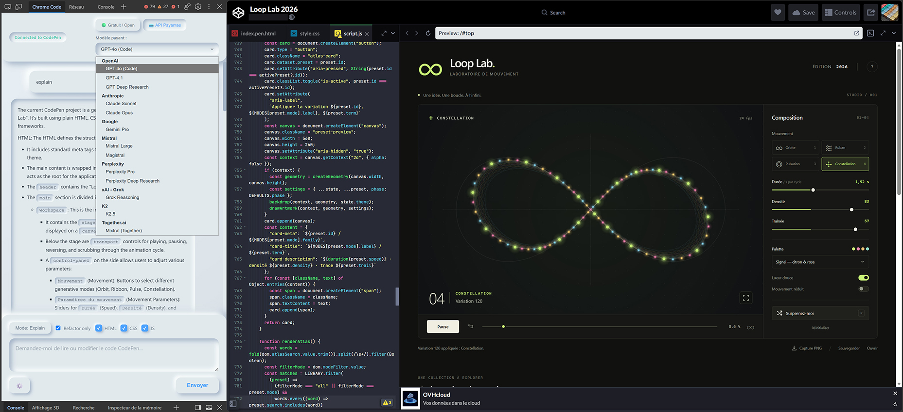

# Chrome Code

Extension Chrome (Manifest V3) qui ajoute un panneau DevTools pour assister l’édition de pens CodePen (HTML/CSS/JS) avec des modèles IA.



## État actuel du projet

Le projet est opérationnel avec :

- un panneau DevTools « Chrome Code » ;
- lecture/écriture du code CodePen via un pont `background -> content -> inject` ;
- compatibilité avec l’éditeur Classic et les fichiers principaux de CodePen 2.0 sous CodeMirror 6 ;
- application de patches incrémentaux basés sur des blocs `[UPDATE_*]` et paires `<<<SEARCH>>>` / `<<<REPLACE>>>` ;
- support de plusieurs fournisseurs cloud (OpenAI, Anthropic, Gemini, Mistral, DeepSeek, Groq, Perplexity, Together, OpenRouter, xAI) ;
- un mode local basé sur l’API Chrome `LanguageModel` (Gemini Nano).

Le mode local est présenté explicitement comme « Chrome AI (Gemini Nano) » :
aucune intégration Ollama, LM Studio ou vLLM n’est simulée.

## Fonctionnement

1. Le panel récupère le code courant (`GET_CODE`) depuis l’onglet inspecté.
2. Le prompt système est construit avec l’état courant du code + options utilisateur (mode, scopes, refactor-only, erreurs console récentes).
3. Un appel IA est lancé (`CALL_MODEL` via le service worker pour le cloud,
   `LanguageModel` directement dans le document DevTools pour Chrome AI).
4. La réponse est parsée :
   - blocs `[UPDATE_HTML]`, `[UPDATE_CSS]`, `[UPDATE_JS]` ;
   - extraction des sections `SEARCH/REPLACE`.
5. Les remplacements valides sont appliqués localement, puis poussés vers CodePen (`UPDATE_CODE`) avec surlignage temporaire des lignes modifiées.

## Architecture

```text
DevTools panel (devtools.js -> panel.html/panel.js)
  ↕ runtime Port
Background service worker (background.js)
  ↕ chrome.tabs.sendMessage
Content script isolé (content.js)
  ↕ window.postMessage
Script main world (inject.js)
  ↕
CodePen editors (CodeMirror 5 et CodeMirror 6)
```

Fichiers principaux :

- `devtools.js` : crée le panneau DevTools.
- `panel.html` / `panel.css` / `panel.js` : UI, réglages, conversation, orchestration patchs.
- `background.js` : routage CodePen et appels aux fournisseurs IA cloud.
- `content.js` : pont extension ↔ page.
- `inject.js` : accès direct aux éditeurs CodePen Classic et CodeMirror 6 dans le main world.
- `js/codepenEditorAdapter.js` : association sûre des scopes HTML/CSS/JS avec les fichiers CodePen 2.0.
- `js/updateParser.js` : parsing robuste des blocs `UPDATE_*` et `SEARCH/REPLACE`.
- `js/patchEngine.js` : validation et application atomique des remplacements exacts et non ambigus.
- `js/agents/Agent.js`, `js/agents/LocalAgent.js` : abstraction client d’appel modèle.

## Modèles / fournisseurs supportés

Le mapping modèle → endpoint est centralisé dans `background.js` (`MODEL_ENDPOINTS`).

Exemples de modèles exposés dans l’UI :

- **Local**: `local-chrome` (Chrome AI / Gemini Nano via `LanguageModel`).
- **OpenAI**: `gpt-4o`, `gpt-4.1`, `gpt-deep-research`.
- **Anthropic**: `claude-sonnet`, `claude-opus`.
- **Google**: `gemini-free`, `gemini-pro`.
- **OpenAI-compatible**: DeepSeek, Mistral, Perplexity, Groq, Together, OpenRouter, xAI.

## Permissions et sécurité

`manifest.json` déclare :

- permissions: `activeTab`, `storage` ;
- host permissions: CodePen (+ sous-domaines), `cdpn.io`, et endpoints API des fournisseurs listés ci-dessus.

Points de sécurité côté rendu/bridge :

- rendu assistant Markdown via `marked` 18.0.9 + sanitation `DOMPurify` 3.4.13 ;
- filtrage strict des messages `window.postMessage` par `source` ;
- clés API stockées en local (`chrome.storage.local`).

## Gestion des erreurs implémentée

- reconnexion automatique du port runtime côté panel ;
- corrélation de chaque requête/réponse par identifiant, sans attente temporelle arbitraire ;
- timeout des appels agents (45s cloud, 60s local) ;
- timeout du bridge content/inject ;
- vérification de disponibilité du modèle local (`LanguageModel.availability()`) ;
- relecture des éditeurs avant application de la réponse IA ;
- rejet atomique des patches ambigus, partiels ou introuvables ;
- confirmation explicite de chaque écriture CodePen et tentative de rollback en cas d’échec.
- lecture et écriture CodeMirror 6 depuis son état documentaire réel (`cmTile.root.view`), pas depuis le DOM virtualisé.

## Développement

### Charger l’extension localement

1. Ouvrir `chrome://extensions`
2. Activer **Developer mode**
3. Cliquer **Load unpacked**
4. Sélectionner ce dossier

### Vérification

La suite Node couvre le parser, le moteur de patches, la corrélation des messages,
le mode local, la syntaxe des scripts et les références du manifeste :

```bash
npm test
```

Le même contrôle est exécuté par GitHub Actions sur chaque pull request et chaque
push vers `main`.

## Limitations connues

- Fort couplage à la structure DOM CodePen.
- Pas de gestion multi-fichiers/projets hors contexte d’un pen actif.
- Dans CodePen 2.0, les scopes historiques HTML/CSS/JS ciblent le fichier principal correspondant (`index.html`/`index.pen.html`, `style.css`, `script.js`) ou le fichier actif ; une sélection ambiguë est refusée plutôt que d’écrire dans le mauvais fichier.
- L’édition incrémentale dépend de la qualité des blocs `SEARCH/REPLACE` fournis par le modèle.
- Le mode local dépend des fonctionnalités IA expérimentales de Chrome.
- Les identifiants et disponibilités des modèles cloud restent dépendants des catalogues fournisseurs et doivent être revérifiés périodiquement.

## Licence

MIT (`LICENSE`).
